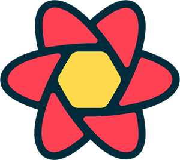
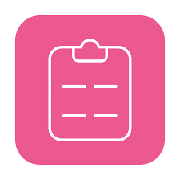
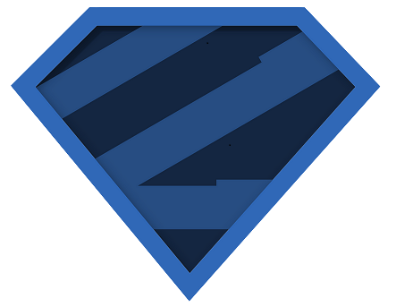
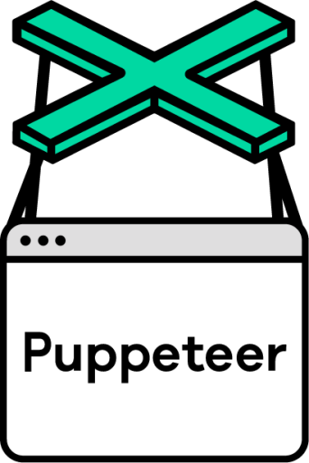

<h1 align="center">Hi 👋, I'm Mohamed Fahmy</h1>
<h3 align="center">Web developer & Web3 security researcher</h3>

<h3 align="left">Connect with me:</h3>

<h3 align="left">Languages and Tools:</h3>

  
  
  
  
  
  
  
  
  
  
  
  
  
  
  
  
  
  
  
  
  
  
  
 

